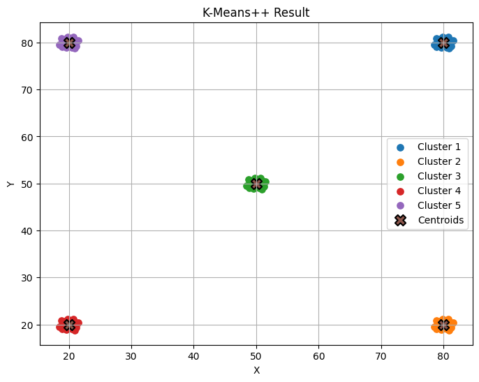
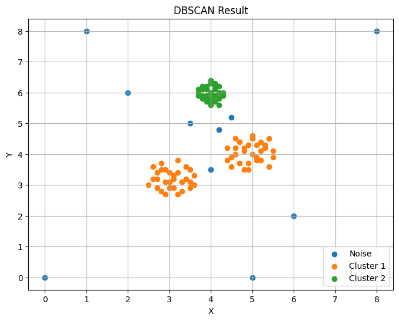

# Custom Clustering Algorithms: K-Means++ & DBSCAN

## Overview
This repository features ground-up implementations of **K-Means++** and **DBSCAN** clustering algorithms built entirely from scratch. Rather than relying on high-level machine learning libraries like `scikit-learn`, these notebooks utilize raw `numpy` for vectorized mathematical operations, custom distance metrics, and algorithmic logic. 

This project demonstrates a deep understanding of centroid initialization probabilities, inertia calculations, and density-based recursive clustering.

## Algorithms Implemented

### 1. K-Means++ (`k_mean++.ipynb`)
A robust implementation of partition-based clustering with optimized centroid initialization to prevent poor local optima.

* **Probabilistic Initialization:** Implements a custom `prob_centroid_initialization` function that selects initial centroids based on their squared distance from existing centroids, reducing convergence time.
* **Inertia Optimization:** The `final_centroids` function runs multiple initialization trials and automatically selects the starting set with the lowest inertia (Within-Cluster Sum of Squares).
* **Dynamic Adjustments:** The `adjusted_centeroids` function iteratively recalculates cluster centers based on the mean coordinates of all assigned local data points until convergence is achieved.

*(Example visualization placeholder - add your matplotlib scatter plot here)*


### 2. DBSCAN (`dbscan_learning.ipynb`)
A Density-Based Spatial Clustering of Applications with Noise (DBSCAN) implementation featuring custom neighborhood evaluation and recursive expansion.

* **Dynamic `Eps` Calculation:** Instead of guessing the epsilon radius, the notebook includes logic to calculate an optimized `Eps` by averaging the minimum distances of the nearest neighbors across the dataset.
* **Custom Neighborhood Search:** The `within(data, pi)` function calculates Euclidean distances across the 2D space to identify all points falling within the `Eps` radius.
* **Recursive Cluster Expansion:** Utilizes a custom `visited()` function that recursively acts as a Depth-First Search (DFS) to expand the cluster, properly tagging points as core points, border points, or noise (`-1`).

*(Example visualization placeholder - add your matplotlib scatter plot here)*


## Tech Stack
* **Python 3**
* **NumPy:** Used for vectorized Euclidean distance calculations (`np.sqrt`, `np.square`, `np.sum`), array manipulation (`np.vstack`), and probabilistic random sampling.

## Project Structure
```text              
├── images/
├── k_mean++.ipynb
└── dbscan_learning.ipynb
